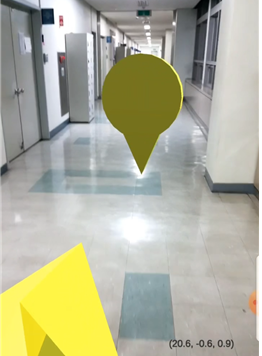
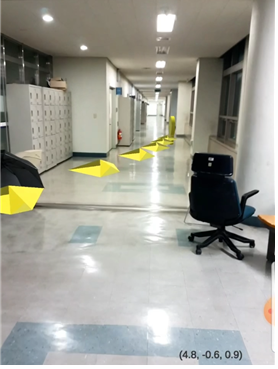
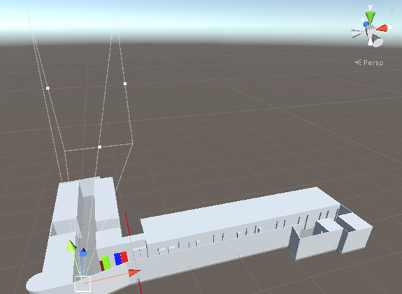
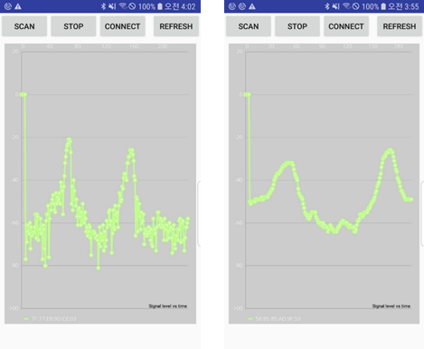
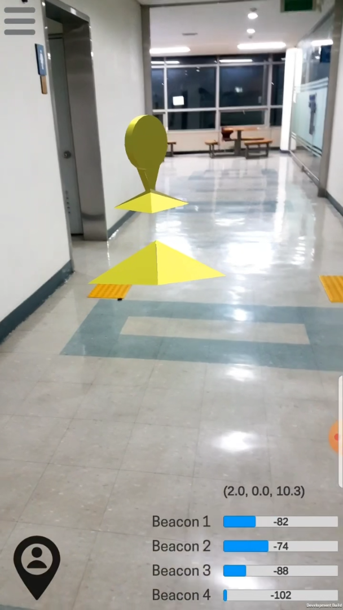

[](https://hsh0321.github.io/)
[](https://www.acmicpc.net/user/ppko1233)
[](http://hits.dwyl.io/hsh0321/AR-Indoor-Navigation)

# Indoor-Navigation-ARCore
 _구글 ARcore SDK를 이용하여 안드로이드 내비게이션 어플리케이션을 구현하였다.(Unity3D Project)_

## Project Info ❓ :


 * Engine　　　　 : **Unity** - 2018.3.4f
 * IDE 　　　　　 : 	**Eclipse** - 2020-03
 * Language　　　: **C#**, **Java13**, **Python**
 * SDK, Library　 　:	**ARcore v1.15.0**, **Tensorflow 1.15 for GPU**

## Features ❗ :
 * BLE Beacon을 이용한 실내 위치 측위 시스템
 * ARcore Slam 알고리즘을 이용한 상대적 위치 업데이트
 * Server(PC)에서 Machine Learning model의 output을 단말기로 전송
 * Unity에서 블루투스 신호를 수신하기 위하여 Native 안드로이드 기능을 사용하기위하여 JAR파일로 플러그인 생성


## discussion ⚠ :
　어플리케이션을 제작하면서 전체적인 UI나 Logic등을 구성하는 것이 흥미로웠던 프로젝트였다.
컴퓨터 그래픽스 과목을 수강하여서 그런지 **Unity**에서 Script 작성을 할 때 크게 어려움을 없었다.
OpenGL 라이브러리를 사용하여 게임 제작을 한 경험이 있는데 그 때는 하드코딩을 하여 엄청난 시간 투자를 하였는데
Unity 툴에서 지원하는 기능 (카메라,오브젝트 생성) 등 매우 간편하게 되어 있다보니 이해하는데 어렵지 않았다.
다만 Unity 자체의 LifeCycle과 구성 동작에 대한 이해가 새롭다보니 개발자노트를 엄청나게 참고한 경험이다.
이 프로젝트를 진행하면서 어려움을 겪었던 것은 Unity를 사용해 게임을 만들다 보면 Android 알림(로컬 푸시)을 사용하거나 
Unity Plugin으로 지원하지 않는 SNS 기능을 사용해야 하는 경우 네이티브로 기능을 구현해야 하는 상황이 종종 발생하게 됩니다. 
JAR 플러그인 을 통해서 C#에서 Java 메소드를 호출하고 Java에서 C# 메소드를 호출하는 방법을 찾아 이 방법을 해결하였습니다.


## Contribute 😀 :
　본 연구에서는 기존의 Beacon을 이용한 실내 위치 측위의 성능을 개선하고 증강현실 응용 소프트웨어를 구현하였다. 머신러닝을 시키기 위해서는 많은 양의 데이터가 필요하다. 따라서, 실험할 환경을 갖추고 약 3만개의 데이터를 수집하였다. Beacon의 특성상 신호가 불안정하기 때문에, 더 정확한 결과 값을 위해서 각각의 신호를 데이터 처리과정을 통하여 안정화 시킨 후 중복 데이터를 제거한 후의 개수는 약 1만개 정도로 감소하였다.
　더 정확한 실내 위치를 측정하기 위해서는 몇 가지 개선점이 필요하다고 생각된다. 먼저, 데이터의 양은 많을수록 정확도가 상승한다. 따라서 데이터를 처리하였을 때, 각 좌표마다 약 500개씩의 데이터가 있도록 데이터를 수집했어야 한다. 그렇다면 지금의 데이터에 비해 약 5배의 데이터를 학습시킬 수 있으므로 더 정확한 결과 값이 나올 것이다. 또한 더 적합한 기계 학습 구조와 필터를 사용한다면 실생활에 적용하는 것에도 큰 문제가 없을 것으로 보이며, 이러한 부분들을 개선한다면 비용이 저렴하고 설치가 용이한 Beacon을 이용하여, 다양한 실내 위치 서비스를 AR 형식으로 제공하기 때문에 사용자들의 편의성을 극대화할 수 있을 것이다.


##### RSSI 값을 이용한 위치 초기화 code 일부분 
```cs
if (rf.isOnClick == true) // Refresh 버튼 onClick 시
{
        Debug.Log("Button is Onclick");
        rf.isOnClick = false;
        sX = rf.scanX; 
        sY = rf.scanY;
        // Native Android에서 측정한 RSSI Input으로 나온 좌표 Output
        cameraTarget.transform.position = new Vector3(sX, 0.0f, sY);
        myCam.transform.position = new Vector3(sX,0.0f,sY);
        Debug.Log("Hwang : After Send" + sX.ToString() + " " + sY.ToString());
}
```

##### ARcore SDK를 이용한 SLAM 응용 (상대적 위치 추적)
```cs
if (Session.Status != SessionStatus.Tracking)
{
    trackingStarted = false;
    camPoseText2.gameObject.SetActive(true);
    const int LOST_TRACKING_SLEEP_TIMEOUT = 15;
    Screen.sleepTimeout = LOST_TRACKING_SLEEP_TIMEOUT;
    return;
}
else
{
    camPoseText.text = "" + cameraTarget.transform.position;
    camPoseText2.gameObject.SetActive(false);
}

Screen.sleepTimeout = SleepTimeout.NeverSleep;

Vector3 currentARPosition = Frame.Pose.position;
if (!trackingStarted)
{
    trackingStarted = true;
    m_prevARPosePosition = Frame.Pose.position;
}

Vector3 deltaPosition = currentARPosition - m_prevARPosePosition; // 상대 위치
m_prevARPosePosition = currentARPosition;
if (cameraTarget != null)
{
    cameraTarget.transform.Translate(deltaPosition.x, 0.0f, deltaPosition.z,Space.World);

    //myCam.GetComponent<FollowTarget>().targetRot = Frame.Pose.rotation;
    //cameraTarget.GetComponent<FollowTarget>().targetRot = Frame.Pose.rotation;  
}
```

　　

　　


